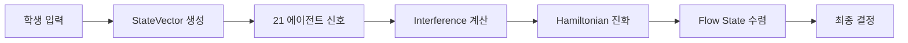

# Quantum Orchestration 설계서

> 22개 교육 AI 에이전트를 양자역학 개념으로 오케스트레이션하는 시스템 설계

**버전**: 1.4  
**작성일**: 2025-12-07  
**최종 수정**: 2025-12-09  
**접근방식**: 진화적 통합 (기존 _brain_engine.py, _memory_engine.py 확장)  
**동기화 상태**: ✅ engine_config.php와 동기화됨

### 📚 관련 문서

| 문서 | 역할 | 바로가기 |
|------|------|---------|
| [00-INDEX.md](./00-INDEX.md) | 문서 허브 | 전체 탐색 |
| [SYSTEM_STATUS.yaml](./SYSTEM_STATUS.yaml) | SSOT | 시스템 현황 |
| [quantum-learning-model.md](./quantum-learning-model.md) | 이론 기반 | 13종 ψ, Hamiltonian, 페르소나 |
| [wavefunction-agent-mapping.md](./wavefunction-agent-mapping.md) | 매핑 규칙 | 13종 ψ ↔ 22개 Agent |
| [quantum-ide-critical-issues.md](./quantum-ide-critical-issues.md) | 구현 문제점 | 17개 Critical Issues |
| [PRD](../../../tasks/0005-prd-quantum-modeling-completion.md) | 구현 로드맵 | Phase 0~4 |
| pocdashboard.php | POC 구현 | 시나리오 1~7 |

---

## 1. 개요

### 1.1 목적

학생의 학습 상태를 **확률 벡터**로 표현하고, 22개 AI 에이전트 간의 **상관관계**와 **간섭 패턴**을 수학적으로 모델링하여 **최적의 학습 상태(Flow State)**를 달성한다.

### 1.2 핵심 개념

| 양자역학 개념 | 교육 시스템 매핑 |
|-------------|----------------|
| 상태 중첩 (Superposition) | 학생의 다차원 학습 상태 |
| 얽힘 (Entanglement) | 에이전트 간 상관관계 |
| 간섭 (Interference) | 다중 신호의 보강/상쇄 |
| 해밀토니안 진화 | Flow State 최적화 |
| 파동함수 붕괴 | 최종 의사결정 (Step 21) |

### 1.3 기존 시스템과의 관계

```
기존 구조                           확장 구조
-----------                        -----------
MemoryWeights (4가중치)      →      StudentStateVector (64차원)
MemoryScore (5컴포넌트)      →      EntanglementMap (21x21 상관)
calculate_composite_score() →      HamiltonianEvolution.evolve_to_flow_state()
```

---

## 2. 아키텍처

### 2.1 시스템 구조

```
┌─────────────────────────────────────────────────────────────┐
│                    Quantum Orchestrator                      │
├─────────────────────────────────────────────────────────────┤
│  ┌──────────────┐  ┌──────────────┐  ┌──────────────┐      │
│  │   학생 상태   │  │  에이전트 맵  │  │   최적화기    │      │
│  │ StateVector  │  │ Entanglement │  │ Hamiltonian  │      │
│  │   (64dim)    │  │   (21x21)    │  │  Evolution   │      │
│  └──────┬───────┘  └──────┬───────┘  └──────┬───────┘      │
│         │                 │                  │              │
│         └────────────────┼──────────────────┘              │
│                          │                                  │
│              ┌───────────▼───────────┐                     │
│              │   InterferenceCalc    │                     │
│              │    (신호 간섭 계산)     │                     │
│              └───────────┬───────────┘                     │
│                          │                                  │
│              ┌───────────▼───────────┐                     │
│              │    Decision Engine    │                     │
│              │  (Step 21 최종 판단)   │                     │
│              └───────────────────────┘                     │
└─────────────────────────────────────────────────────────────┘
```

### 2.2 데이터 흐름



---

## 3. 핵심 컴포넌트

### 3.1 StudentStateVector (학생 상태 벡터)

**파일**: `holons/_quantum_state.py` (신규)

```python
from dataclasses import dataclass, field
from typing import List
import numpy as np

@dataclass
class StudentStateVector:
    """
    학생의 학습 상태를 64차원 확률 벡터로 표현

    각 차원은 [0.0, 1.0] 범위의 확률값
    0.5 = 중립 상태 (정보 부족)
    """

    # === 인지 차원 (16) ===
    concept_mastery: float = 0.5      # 개념 이해도
    procedural_fluency: float = 0.5   # 절차적 유창성
    cognitive_load: float = 0.5       # 인지 부하
    attention_level: float = 0.5      # 집중도
    working_memory: float = 0.5       # 작업 기억 용량
    metacognition: float = 0.5        # 메타인지 수준
    transfer_ability: float = 0.5     # 전이 능력
    problem_representation: float = 0.5  # 문제 표상 능력
    schema_activation: float = 0.5    # 스키마 활성화
    retrieval_strength: float = 0.5   # 인출 강도
    encoding_depth: float = 0.5       # 인코딩 깊이
    elaboration: float = 0.5          # 정교화 수준
    retention_strength: float = 0.5   # 기억 유지 강도
    discrimination: float = 0.5       # 변별 능력
    generalization: float = 0.5       # 일반화 능력
    cognitive_flexibility: float = 0.5  # 인지적 유연성

    # === 정서 차원 (16) ===
    motivation: float = 0.5           # 내재적 동기
    self_efficacy: float = 0.5        # 자기 효능감
    confidence: float = 0.5           # 자신감
    curiosity: float = 0.5            # 호기심
    interest: float = 0.5             # 흥미
    anxiety: float = 0.5              # 불안 (역방향)
    frustration: float = 0.5          # 좌절감 (역방향)
    boredom: float = 0.5              # 지루함 (역방향)
    confusion: float = 0.5            # 혼란 (조건부)
    engagement_emotion: float = 0.5   # 정서적 몰입
    achievement_emotion: float = 0.5  # 성취 감정
    social_emotion: float = 0.5       # 사회적 감정
    epistemic_emotion: float = 0.5    # 인식론적 감정
    growth_mindset: float = 0.5       # 성장 마인드셋
    resilience: float = 0.5           # 회복탄력성
    emotional_regulation: float = 0.5  # 감정 조절

    # === 행동 차원 (16) ===
    engagement_behavior: float = 0.5  # 행동적 참여
    persistence: float = 0.5          # 과제 지속성
    help_seeking: float = 0.5         # 도움 요청 행동
    self_regulation: float = 0.5      # 자기 조절
    time_management: float = 0.5      # 시간 관리
    effort_investment: float = 0.5    # 노력 투자
    strategy_use: float = 0.5         # 학습 전략 사용
    practice_frequency: float = 0.5   # 연습 빈도
    review_behavior: float = 0.5      # 복습 행동
    note_taking: float = 0.5          # 노트 정리
    question_asking: float = 0.5      # 질문 행동
    collaboration: float = 0.5        # 협력 학습
    resource_utilization: float = 0.5  # 자원 활용
    goal_setting: float = 0.5         # 목표 설정
    self_monitoring: float = 0.5      # 자기 모니터링
    adaptive_behavior: float = 0.5    # 적응적 행동

    # === 컨텍스트 차원 (16) ===
    time_pressure: float = 0.5        # 시간 압박
    time_of_day: float = 0.5          # 학습 시간대
    session_duration: float = 0.5     # 학습 세션 길이
    break_pattern: float = 0.5        # 휴식 패턴
    social_context: float = 0.5       # 사회적 맥락
    peer_influence: float = 0.5       # 또래 영향
    teacher_support: float = 0.5      # 교사 지원
    family_support: float = 0.5       # 가정 지원
    physical_fatigue: float = 0.5     # 신체 피로
    sleep_quality: float = 0.5        # 수면 품질
    nutrition_state: float = 0.5      # 영양 상태
    environment_fit: float = 0.5      # 물리적 환경
    distraction_level: float = 0.5    # 방해 요소
    technology_access: float = 0.5    # 기술 접근성
    content_difficulty: float = 0.5   # 콘텐츠 난이도
    prior_knowledge: float = 0.5      # 선행 지식

    def to_vector(self) -> np.ndarray:
        """64차원 numpy 벡터로 변환"""
        return np.array([getattr(self, f.name) for f in fields(self)])

    @classmethod
    def from_vector(cls, vec: np.ndarray) -> 'StudentStateVector':
        """numpy 벡터에서 StudentStateVector 생성"""
        field_names = [f.name for f in fields(cls)]
        return cls(**{name: float(vec[i]) for i, name in enumerate(field_names)})

    def normalize(self) -> 'StudentStateVector':
        """확률 벡터 정규화 (합 = 1)"""
        vec = self.to_vector()
        normalized = vec / vec.sum()
        return self.from_vector(normalized)

    def inner_product(self, other: 'StudentStateVector') -> float:
        """두 상태 벡터의 내적 (유사도)"""
        return float(np.dot(self.to_vector(), other.to_vector()))
```

### 3.2 EntanglementMap (에이전트 얽힘 맵)

**파일**: `holons/_quantum_entanglement.py` (신규)

```python
from dataclasses import dataclass
from typing import Dict, List, Tuple
import numpy as np
from math import pi

@dataclass
class EntanglementEdge:
    """두 에이전트 간의 얽힘 관계"""
    agent_a: int           # 에이전트 번호 (1-21)
    agent_b: int           # 상대 에이전트 번호
    correlation: float     # 상관 강도 (-1.0 ~ 1.0)
    phase: float           # 위상 (0 ~ 2π)
    description: str = ""  # 관계 설명

    def __post_init__(self):
        if not -1.0 <= self.correlation <= 1.0:
            raise ValueError(f"correlation must be in [-1, 1], got {self.correlation}")
        if not 0 <= self.phase <= 2 * pi:
            self.phase = self.phase % (2 * pi)


class EntanglementMap:
    """
    22개 에이전트의 얽힘 관계 그래프

    - 양의 상관 (correlation > 0): 동시 활성화 경향
    - 음의 상관 (correlation < 0): 상호 억제 경향
    - 위상: 신호 간섭 시 사용
    
    ⚠️ AGENTS 정의는 engine_config.php와 동기화됨 (SSOT)
    """

    # 22개 에이전트 정의 (engine_config.php 기준)
    AGENTS = {
        1: "온보딩",              # onboarding
        2: "시험일정",            # exam_schedule
        3: "목표분석",            # goals_analysis
        4: "약점검사",            # inspect_weakpoints
        5: "학습감정",            # learning_emotion
        6: "교사피드백",          # teacher_feedback
        7: "상호작용타겟팅",      # interaction_targeting
        8: "평온도",              # calmness
        9: "학습관리",            # learning_management
        10: "개념노트",           # concept_notes
        11: "문제노트",           # problem_notes
        12: "휴식루틴",           # rest_routine
        13: "학습이탈",           # learning_dropout
        14: "현재위치",           # current_position
        15: "문제재정의",         # problem_redefinition
        16: "상호작용준비",       # interaction_preparation
        17: "남은활동",           # remaining_activities
        18: "시그니처루틴",       # signature_routine
        19: "상호작용콘텐츠",     # interaction_content
        20: "개입준비",           # intervention_preparation
        21: "개입실행",           # intervention_execution
        22: "모듈개선"            # module_improvement
    }

    # 핵심 얽힘 관계 (실제 에이전트 기반, engine_config.php와 동기화)
    CORE_ENTANGLEMENTS: List[EntanglementEdge] = [
        # === Phase 1: 정보 수집 축 ===
        EntanglementEdge(1, 3, 0.9, 0, "온보딩→목표분석 순차"),
        EntanglementEdge(3, 4, 0.85, pi/6, "목표분석→약점검사"),
        EntanglementEdge(2, 17, 0.8, 0, "시험일정→남은활동 연동"),

        # === 감정-상태 관리 축 ===
        EntanglementEdge(5, 8, 0.9, 0, "학습감정→평온도 연동"),
        EntanglementEdge(8, 13, 0.85, pi/4, "평온도→학습이탈 예방"),
        EntanglementEdge(5, 6, 0.7, 0, "학습감정→교사피드백 반영"),

        # === 학습 관리 축 ===
        EntanglementEdge(9, 14, 0.85, 0, "학습관리→현재위치 파악"),
        EntanglementEdge(9, 17, 0.8, pi/6, "학습관리→남은활동 계획"),
        EntanglementEdge(14, 15, 0.75, 0, "현재위치→문제재정의"),

        # === 노트-루틴 축 ===
        EntanglementEdge(10, 11, 0.9, 0, "개념노트↔문제노트"),
        EntanglementEdge(12, 18, 0.85, pi/6, "휴식루틴→시그니처루틴"),

        # === 상호작용 축 ===
        EntanglementEdge(7, 16, 0.9, 0, "상호작용타겟팅→상호작용준비"),
        EntanglementEdge(16, 19, 0.85, 0, "상호작용준비→상호작용콘텐츠"),

        # === 개입 축 ===
        EntanglementEdge(20, 21, 0.95, 0, "개입준비→개입실행 순차"),
        EntanglementEdge(13, 20, 0.85, pi/4, "학습이탈→개입준비 트리거"),

        # === 시스템 개선 축 ===
        EntanglementEdge(21, 22, 0.7, pi/6, "개입실행→모듈개선 피드백"),

        # === 억제 관계 (음의 상관) ===
        EntanglementEdge(13, 8, -0.4, pi, "학습이탈↔평온도 역상관"),
        EntanglementEdge(5, 12, -0.3, pi, "부정감정↔휴식루틴 방해"),
    ]

    def __init__(self, custom_edges: List[EntanglementEdge] = None):
        self.edges = self.CORE_ENTANGLEMENTS.copy()
        if custom_edges:
            self.edges.extend(custom_edges)
        self._build_correlation_matrix()

    def _build_correlation_matrix(self):
        """22x22 상관행렬 생성"""
        self._matrix = np.eye(22)  # 대각선 = 1
        self._phase_matrix = np.zeros((22, 22))

        for edge in self.edges:
            i, j = edge.agent_a - 1, edge.agent_b - 1
            self._matrix[i, j] = edge.correlation
            self._matrix[j, i] = edge.correlation
            self._phase_matrix[i, j] = edge.phase
            self._phase_matrix[j, i] = -edge.phase  # 대칭 위상

    def get_correlation(self, agent_a: int, agent_b: int) -> float:
        """두 에이전트 간 상관계수"""
        return self._matrix[agent_a - 1, agent_b - 1]

    def get_phase(self, agent_a: int, agent_b: int) -> float:
        """두 에이전트 간 위상차"""
        return self._phase_matrix[agent_a - 1, agent_b - 1]

    def get_correlation_matrix(self) -> np.ndarray:
        """전체 상관행렬 반환"""
        return self._matrix.copy()

    def get_strongly_correlated_pairs(self, threshold: float = 0.7) -> List[Tuple[int, int, float]]:
        """강한 상관관계 쌍 반환"""
        pairs = []
        for i in range(22):
            for j in range(i + 1, 22):
                if abs(self._matrix[i, j]) >= threshold:
                    pairs.append((i + 1, j + 1, self._matrix[i, j]))
        return sorted(pairs, key=lambda x: -abs(x[2]))
```

### 3.3 InterferenceCalculator (간섭 계산기)

**파일**: `holons/_quantum_interference.py` (신규)

```python
from dataclasses import dataclass
from typing import Dict, Tuple, List
import numpy as np
from math import cos, sin

@dataclass
class AgentSignal:
    """단일 에이전트의 출력 신호"""
    agent_id: int
    amplitude: float      # 신호 강도 [0, 1]
    phase: float          # 신호 위상 [0, 2π]
    confidence: float     # 신뢰도 [0, 1]


class InterferenceCalculator:
    """
    다중 에이전트 신호의 양자 간섭 계산

    핵심 원리:
    - 동위상 신호: 보강 간섭 (합산)
    - 역위상 신호: 상쇄 간섭 (상쇄)
    - 얽힘 상관계수가 간섭 강도를 조절
    """

    def __init__(self, entanglement_map: 'EntanglementMap'):
        self.entanglement = entanglement_map

    def calculate_total_interference(
        self,
        signals: List[AgentSignal]
    ) -> Tuple[float, Dict[str, float]]:
        """
        다중 신호의 총 간섭 결과 계산

        Returns:
            (total_intensity, details_dict)
        """
        n = len(signals)
        if n == 0:
            return 0.0, {}

        total = 0.0
        constructive = 0.0
        destructive = 0.0

        for i, sig_i in enumerate(signals):
            # 자기 간섭 항
            self_term = sig_i.amplitude ** 2 * sig_i.confidence
            total += self_term
            constructive += self_term

            for sig_j in signals[i + 1:]:
                # 교차 간섭 항
                corr = self.entanglement.get_correlation(sig_i.agent_id, sig_j.agent_id)
                phase_diff = sig_i.phase - sig_j.phase

                # 간섭 공식: 2 * A_i * A_j * cos(φ_i - φ_j) * correlation
                cross_term = (
                    2 * sig_i.amplitude * sig_j.amplitude
                    * cos(phase_diff)
                    * corr
                    * min(sig_i.confidence, sig_j.confidence)
                )

                total += cross_term

                if cross_term > 0:
                    constructive += cross_term
                else:
                    destructive += abs(cross_term)

        details = {
            "total_intensity": total,
            "constructive": constructive,
            "destructive": destructive,
            "net_gain": constructive - destructive,
            "interference_ratio": constructive / (destructive + 1e-10)
        }

        return total, details

    def find_resonance_pattern(
        self,
        signals: List[AgentSignal],
        target_agents: List[int] = None
    ) -> List[AgentSignal]:
        """
        최대 보강 간섭을 위한 위상 조정

        Args:
            signals: 현재 신호들
            target_agents: 공명시킬 대상 에이전트들 (None이면 전체)

        Returns:
            위상 조정된 신호 리스트
        """
        if target_agents is None:
            target_agents = [s.agent_id for s in signals]

        adjusted = []
        reference_phase = signals[0].phase if signals else 0

        for sig in signals:
            if sig.agent_id in target_agents:
                # 타겟 에이전트는 기준 위상으로 정렬
                new_phase = reference_phase
            else:
                # 비타겟은 현재 위상 유지
                new_phase = sig.phase

            adjusted.append(AgentSignal(
                agent_id=sig.agent_id,
                amplitude=sig.amplitude,
                phase=new_phase,
                confidence=sig.confidence
            ))

        return adjusted
```

### 3.4 HamiltonianEvolution (해밀토니안 진화)

**파일**: `holons/_quantum_evolution.py` (신규)

```python
from dataclasses import dataclass
from typing import Dict, List, Optional, Callable
import numpy as np

@dataclass
class EvolutionConfig:
    """진화 알고리즘 설정"""
    learning_rate: float = 0.1
    max_iterations: int = 100
    convergence_threshold: float = 1e-6
    regularization: float = 0.01


class HamiltonianEvolution:
    """
    학생 상태의 시간 진화 - Flow State 최적화

    물리학 개념:
    - Hamiltonian: 시스템의 총 에너지 연산자
    - 에너지 최소화 = 최적 상태 탐색

    교육학 매핑:
    - 낮은 에너지 = 높은 학습 효율 (Flow State)
    - 높은 에너지 = 학습 저해 요인 존재
    """

    # 에이전트별 상태 차원 매핑 (engine_config.php와 동기화)
    AGENT_STATE_MAPPING: Dict[int, Dict[str, List[str]]] = {
        1: {  # 온보딩
            "positive": ["goal_setting", "prior_knowledge", "engagement_behavior"],
            "negative": ["confusion", "anxiety"]
        },
        3: {  # 목표분석
            "positive": ["goal_setting", "metacognition", "self_monitoring"],
            "negative": ["confusion", "distraction_level"]
        },
        4: {  # 약점검사
            "positive": ["concept_mastery", "discrimination", "retrieval_strength"],
            "negative": ["cognitive_load", "confusion"]
        },
        5: {  # 학습감정
            "positive": ["emotional_regulation", "engagement_emotion", "resilience"],
            "negative": ["anxiety", "frustration", "boredom"]
        },
        8: {  # 평온도
            "positive": ["emotional_regulation", "confidence", "resilience"],
            "negative": ["anxiety", "frustration"]
        },
        9: {  # 학습관리
            "positive": ["time_management", "self_regulation", "adaptive_behavior"],
            "negative": ["distraction_level", "time_pressure"]
        },
        13: {  # 학습이탈
            "positive": ["persistence", "motivation", "engagement_behavior"],
            "negative": ["boredom", "frustration", "distraction_level"]
        },
        14: {  # 현재위치
            "positive": ["metacognition", "self_monitoring", "concept_mastery"],
            "negative": ["confusion", "cognitive_load"]
        },
        20: {  # 개입준비
            "positive": ["teacher_support", "help_seeking", "adaptive_behavior"],
            "negative": ["anxiety", "social_emotion"]
        },
        21: {  # 개입실행
            "positive": ["engagement_behavior", "attention_level", "confidence"],
            "negative": ["anxiety", "confusion"]
        },
        22: {  # 모듈개선
            "positive": ["adaptive_behavior", "self_monitoring", "strategy_use"],
            "negative": []  # 시스템 레벨
        }
        # 나머지 에이전트는 필요 시 확장
    }

    def __init__(
        self,
        entanglement: 'EntanglementMap',
        config: EvolutionConfig = None
    ):
        self.entanglement = entanglement
        self.config = config or EvolutionConfig()
        self._iteration_history: List[float] = []

    def compute_hamiltonian(
        self,
        state: 'StudentStateVector'
    ) -> np.ndarray:
        """
        시스템 해밀토니안 구성

        H = H_local + H_interaction

        - H_local: 학생 상태 기반 로컬 에너지
        - H_interaction: 에이전트 간 상호작용 에너지
        """
        n = 21
        H = np.zeros((n, n))

        # 로컬 에너지 항
        for agent_id in range(1, n + 1):
            H[agent_id - 1, agent_id - 1] = self._local_energy(agent_id, state)

        # 상호작용 항 (얽힘 기반)
        interaction_strength = 0.1  # 하이퍼파라미터
        correlation_matrix = self.entanglement.get_correlation_matrix()
        H += correlation_matrix * interaction_strength

        return H

    def _local_energy(self, agent_id: int, state: 'StudentStateVector') -> float:
        """
        에이전트별 로컬 에너지 계산

        에너지 = - Σ(positive_dims) + Σ(negative_dims)
        (낮은 에너지 = 좋은 상태)
        """
        mapping = self.AGENT_STATE_MAPPING.get(agent_id, {})
        if not mapping:
            return 0.0

        state_vec = state.__dict__

        positive_sum = sum(
            state_vec.get(dim, 0.5)
            for dim in mapping.get("positive", [])
        )
        negative_sum = sum(
            state_vec.get(dim, 0.5)
            for dim in mapping.get("negative", [])
        )

        return -positive_sum + negative_sum

    def evolve_to_flow_state(
        self,
        initial_state: 'StudentStateVector',
        target_state: Optional['StudentStateVector'] = None
    ) -> 'StudentStateVector':
        """
        경사 하강법으로 Flow State 수렴

        Update rule: ψ_new = ψ - η * ∇E(ψ)

        Args:
            initial_state: 초기 학생 상태
            target_state: 목표 상태 (None이면 에너지 최소화)

        Returns:
            최적화된 StudentStateVector
        """
        state_vec = initial_state.to_vector()
        cfg = self.config
        self._iteration_history = []

        for iteration in range(cfg.max_iterations):
            H = self.compute_hamiltonian(
                StudentStateVector.from_vector(state_vec)
            )

            # 현재 에너지
            # (21차원 축소 -> 64차원 상태 벡터에 투영)
            energy = self._compute_total_energy(state_vec, H)
            self._iteration_history.append(energy)

            # 경사 계산 (수치 미분)
            gradient = self._numerical_gradient(state_vec, H)

            # 업데이트
            state_vec = state_vec - cfg.learning_rate * gradient

            # 값 범위 클리핑 [0, 1]
            state_vec = np.clip(state_vec, 0.0, 1.0)

            # 수렴 체크
            if len(self._iteration_history) > 1:
                delta = abs(self._iteration_history[-1] - self._iteration_history[-2])
                if delta < cfg.convergence_threshold:
                    break

        return StudentStateVector.from_vector(state_vec)

    def _compute_total_energy(self, state_vec: np.ndarray, H: np.ndarray) -> float:
        """총 시스템 에너지 계산"""
        # 64차원 상태를 21차원 에이전트 활성화로 투영
        agent_activation = self._state_to_agent_activation(state_vec)
        return float(agent_activation @ H @ agent_activation)

    def _state_to_agent_activation(self, state_vec: np.ndarray) -> np.ndarray:
        """64차원 학생 상태 → 22차원 에이전트 활성화"""
        activation = np.zeros(22)
        for agent_id in range(1, 23):
            mapping = self.AGENT_STATE_MAPPING.get(agent_id, {})
            positive_dims = mapping.get("positive", [])

            # 해당 에이전트 관련 차원들의 평균
            if positive_dims:
                indices = [self._dim_to_index(dim) for dim in positive_dims]
                activation[agent_id - 1] = np.mean([state_vec[i] for i in indices if i >= 0])
            else:
                activation[agent_id - 1] = 0.5

        return activation

    def _dim_to_index(self, dim_name: str) -> int:
        """차원 이름 → 인덱스 변환"""
        # StudentStateVector의 필드 순서와 매칭
        dim_order = [
            # 인지 16
            "concept_mastery", "procedural_fluency", "cognitive_load", "attention_level",
            "working_memory", "metacognition", "transfer_ability", "problem_representation",
            "schema_activation", "retrieval_strength", "encoding_depth", "elaboration",
            "retention_strength", "discrimination", "generalization", "cognitive_flexibility",
            # 정서 16
            "motivation", "self_efficacy", "confidence", "curiosity", "interest",
            "anxiety", "frustration", "boredom", "confusion", "engagement_emotion",
            "achievement_emotion", "social_emotion", "epistemic_emotion", "growth_mindset",
            "resilience", "emotional_regulation",
            # 행동 16
            "engagement_behavior", "persistence", "help_seeking", "self_regulation",
            "time_management", "effort_investment", "strategy_use", "practice_frequency",
            "review_behavior", "note_taking", "question_asking", "collaboration",
            "resource_utilization", "goal_setting", "self_monitoring", "adaptive_behavior",
            # 컨텍스트 16
            "time_pressure", "time_of_day", "session_duration", "break_pattern",
            "social_context", "peer_influence", "teacher_support", "family_support",
            "physical_fatigue", "sleep_quality", "nutrition_state", "environment_fit",
            "distraction_level", "technology_access", "content_difficulty", "prior_knowledge"
        ]
        try:
            return dim_order.index(dim_name)
        except ValueError:
            return -1

    def _numerical_gradient(self, state_vec: np.ndarray, H: np.ndarray) -> np.ndarray:
        """수치 미분으로 경사 계산"""
        epsilon = 1e-5
        gradient = np.zeros_like(state_vec)

        for i in range(len(state_vec)):
            state_plus = state_vec.copy()
            state_plus[i] += epsilon

            state_minus = state_vec.copy()
            state_minus[i] -= epsilon

            energy_plus = self._compute_total_energy(state_plus, H)
            energy_minus = self._compute_total_energy(state_minus, H)

            gradient[i] = (energy_plus - energy_minus) / (2 * epsilon)

        return gradient

    def get_convergence_history(self) -> List[float]:
        """에너지 수렴 히스토리 반환"""
        return self._iteration_history.copy()
```

---

## 4. 기존 시스템 통합

### 4.1 _brain_engine.py 확장

기존 `MemoryWeights` 시스템과 새로운 `StudentStateVector`를 연결:

```python
# holons/_brain_engine.py 에 추가

from holons._quantum_state import StudentStateVector
from holons._quantum_evolution import HamiltonianEvolution

class EnhancedBrainEngine(BrainEngine):
    """기존 BrainEngine + Quantum Orchestration"""

    def __init__(self, *args, **kwargs):
        super().__init__(*args, **kwargs)
        self.entanglement = EntanglementMap()
        self.evolution = HamiltonianEvolution(self.entanglement)

    def calculate_quantum_score(
        self,
        holon: dict,
        student_state: StudentStateVector
    ) -> float:
        """
        기존 composite_score + 학생 상태 반영
        """
        # 기존 스코어
        base_score = self.calculate_composite_score(holon)

        # Quantum 조정
        optimized_state = self.evolution.evolve_to_flow_state(student_state)
        flow_factor = self._calculate_flow_factor(optimized_state)

        return base_score * flow_factor

    def _calculate_flow_factor(self, state: StudentStateVector) -> float:
        """Flow State 근접도 계산 (0.5 ~ 1.5 범위)"""
        # 핵심 Flow 지표들의 가중 평균
        flow_indicators = [
            state.attention_level,
            state.engagement_behavior,
            state.motivation,
            1 - state.anxiety,  # 역방향
            1 - state.cognitive_load,  # 역방향
        ]

        avg = sum(flow_indicators) / len(flow_indicators)
        return 0.5 + avg  # [0.5, 1.5] 범위로 변환
```

### 4.2 _memory_engine.py 확장

기존 `MemoryScore`와 `StudentStateVector` 상호 변환:

```python
# holons/_memory_engine.py 에 추가

class EnhancedMemoryEngine(MemoryEngine):
    """기존 MemoryEngine + Quantum State 통합"""

    @staticmethod
    def memory_score_to_state_vector(score: MemoryScore) -> StudentStateVector:
        """MemoryScore를 StudentStateVector 일부 차원에 매핑"""
        state = StudentStateVector()

        # MemoryScore 5개 컴포넌트 → 관련 차원에 매핑
        state.practice_frequency = score.usage_frequency
        state.achievement_emotion = score.impact_score
        state.metacognition = score.system_reflection
        state.goal_setting = score.goal_alignment
        state.emotional_regulation = score.emotional_intensity

        return state

    @staticmethod
    def state_vector_to_memory_score(state: StudentStateVector) -> MemoryScore:
        """StudentStateVector에서 MemoryScore 관련 값 추출"""
        return MemoryScore(
            usage_frequency=state.practice_frequency,
            impact_score=state.achievement_emotion,
            system_reflection=state.metacognition,
            goal_alignment=state.goal_setting,
            emotional_intensity=state.emotional_regulation
        )
```

---

## 5. 사용 예시

### 5.1 기본 사용법

```python
from holons._quantum_state import StudentStateVector
from holons._quantum_entanglement import EntanglementMap
from holons._quantum_evolution import HamiltonianEvolution, EvolutionConfig

# 1. 학생 현재 상태 정의
student = StudentStateVector(
    concept_mastery=0.6,
    cognitive_load=0.7,      # 높음 - 문제
    motivation=0.4,          # 낮음 - 문제
    anxiety=0.6,             # 높음 - 문제
    attention_level=0.5,
    persistence=0.6,
)

# 2. 에이전트 얽힘 맵 로드
entanglement = EntanglementMap()

# 3. Flow State로 진화
config = EvolutionConfig(learning_rate=0.05, max_iterations=50)
evolution = HamiltonianEvolution(entanglement, config)

optimized = evolution.evolve_to_flow_state(student)

# 4. 결과 확인
print(f"Before: anxiety={student.anxiety}, motivation={student.motivation}")
print(f"After:  anxiety={optimized.anxiety}, motivation={optimized.motivation}")
```

### 5.2 서버 API 통합

```python
# server.py 에 추가

@app.route('/api/quantum/optimize', methods=['POST'])
def quantum_optimize():
    """학생 상태 최적화 API"""
    data = request.json

    # 입력 파싱
    state_dict = data.get('student_state', {})
    student = StudentStateVector(**state_dict)

    # 최적화 실행
    entanglement = EntanglementMap()
    evolution = HamiltonianEvolution(entanglement)
    optimized = evolution.evolve_to_flow_state(student)

    return jsonify({
        'original': student.__dict__,
        'optimized': optimized.__dict__,
        'convergence_steps': len(evolution.get_convergence_history()),
        'energy_reduction': evolution.get_convergence_history()[0] - evolution.get_convergence_history()[-1]
    })
```

---

## 5.3 가중치 붕괴 시나리오 (Wave Function Collapse)

### 개념

학생 데이터의 **정체 상태**를 감지하고, 가능한 **미래 시나리오들의 중첩 상태**를 계산한 후, 확률적으로 가장 가능성 높은 시나리오로 **파동함수 붕괴**를 수행하여 선제적 개입 결정을 내린다.

```
정체 감지 → 미래 시나리오 중첩 → 확률 조정 → 파동함수 붕괴 → 개입 결정
```

### 핵심 수식

#### 1. 정체 점수 (Stagnation Score)

```
S_stagnation = 1 / (1 + σ²)
```

- σ² = 최근 N일간 데이터의 분산
- 분산이 작을수록 정체 점수가 높음 (최대 1.0)

#### 2. 미래 시나리오 중첩 (Superposition)

```
|ψ⟩ = α|반등⟩ + β|하락⟩ + γ|정체⟩
```

- 각 시나리오는 고유한 위상(phase)을 가짐
  - 반등: 0° (건강한 상태)
  - 정체: 90° (중립)
  - 하락: 135° (위험 상태)

#### 3. 베이지안 확률 조정 (Bayesian Update)

```python
P(scenario | context) = P(context | scenario) × P(scenario) / P(context)
```

맥락 인자:
- `stagnation_long`: 정체 지속 기간 ≥ 5일 → 하락 확률 ×1.2
- `near_critical`: 현재값 < 기준선 - 5% → 하락 확률 ×1.3
- `recent_decline`: 추세 < -0.5 → 하락 확률 ×1.1

#### 4. Quantum Amplitude 계산

```python
amplitude = sqrt(probability)
phase = scenario_phase_deg * π / 180
```

#### 5. 파동함수 붕괴 (Collapse)

```python
collapsed_scenario = argmax(P(scenario | context))
entropy_reduction = H_before - H_after
```

- 엔트로피 감소량 = 의사결정 정보량
- H_before: 붕괴 전 엔트로피 (불확실성)
- H_after = 0: 붕괴 후 완전 확정

### 구현 예시

```python
from dataclasses import dataclass
from typing import List, Dict
import math

@dataclass
class FutureScenario:
    """미래 시나리오 정의"""
    name: str
    phase_deg: float
    base_probability: float
    predicted_value: float
    agent_intervention: str

class WaveFunctionCollapse:
    """
    파동함수 붕괴 엔진
    
    정체 상태 감지 → 미래 시나리오 중첩 → 확률 조정 → 붕괴
    """
    
    # 기본 미래 시나리오 정의 (engine_config.php 에이전트 이름과 동기화)
    DEFAULT_SCENARIOS = {
        "rebound": FutureScenario("반등", 0, 0.35, 78, "Agent08_평온도"),      # calmness
        "decline": FutureScenario("하락", 135, 0.40, 62, "Agent05_학습감정"),  # learning_emotion
        "plateau": FutureScenario("정체 지속", 90, 0.25, 72, "Agent09_학습관리")  # learning_management
    }
    
    def __init__(self, decay_factor: float = 0.3):
        self.decay_factor = decay_factor  # 시간적 감쇠율
    
    def detect_stagnation(self, values: List[float], window: int = 6) -> Dict:
        """정체 패턴 감지"""
        recent = values[-window:]
        mean = sum(recent) / len(recent)
        variance = sum((v - mean) ** 2 for v in recent) / len(recent)
        trend = (recent[-1] - recent[0]) / window
        
        stagnation_score = 1.0 / (1.0 + variance)
        
        return {
            "stagnation_score": stagnation_score,
            "variance": variance,
            "trend": trend,
            "pattern": "STAGNANT" if variance < 1.0 else "FLUCTUATING"
        }
    
    def calculate_adjusted_probabilities(
        self,
        stagnation_days: int,
        current_value: float,
        baseline: float,
        trend: float
    ) -> Dict[str, float]:
        """베이지안 확률 조정"""
        # 맥락 인자 계산
        stagnation_factor = 1.2 if stagnation_days >= 5 else 1.0
        critical_factor = 1.3 if current_value < baseline - 5 else 1.0
        trend_factor = 1.1 if trend < -0.5 else 1.0
        
        decline_boost = stagnation_factor * critical_factor * trend_factor
        rebound_penalty = 1.0 / decline_boost
        
        probs = {
            "rebound": self.DEFAULT_SCENARIOS["rebound"].base_probability * rebound_penalty,
            "decline": self.DEFAULT_SCENARIOS["decline"].base_probability * decline_boost,
            "plateau": self.DEFAULT_SCENARIOS["plateau"].base_probability
        }
        
        # 정규화
        total = sum(probs.values())
        return {k: v / total for k, v in probs.items()}
    
    def collapse(self, adjusted_probs: Dict[str, float]) -> Dict:
        """파동함수 붕괴 수행"""
        # 가장 높은 확률의 시나리오로 붕괴
        collapsed_key = max(adjusted_probs, key=adjusted_probs.get)
        collapsed_scenario = self.DEFAULT_SCENARIOS[collapsed_key]
        collapse_prob = adjusted_probs[collapsed_key]
        
        # 엔트로피 계산
        entropy_before = -sum(
            p * math.log2(p) if p > 0 else 0 
            for p in adjusted_probs.values()
        )
        entropy_after = 0  # 완전 확정
        
        return {
            "collapsed_to": collapsed_key,
            "collapsed_scenario": collapsed_scenario,
            "collapse_probability": collapse_prob,
            "entropy_reduction": entropy_before - entropy_after,
            "quantum_signals": [
                {
                    "scenario": k,
                    "amplitude": math.sqrt(p),
                    "phase_deg": self.DEFAULT_SCENARIOS[k].phase_deg,
                    "probability": p * 100
                }
                for k, p in adjusted_probs.items()
            ]
        }
    
    def predict_with_intervention(
        self,
        current_value: float,
        collapsed_scenario: FutureScenario,
        baseline: float
    ) -> Dict:
        """개입 여부에 따른 미래 예측"""
        return {
            "current_state": f"{current_value}% (정체)",
            "if_no_intervention": f"{collapsed_scenario.predicted_value}%",
            "if_intervention": f"{baseline}% (기준선 복귀)",
            "intervention_value": baseline - collapsed_scenario.predicted_value
        }
```

### 사용 예시

```python
# 침착도 데이터 정체 감지 및 미래 예측
engine = WaveFunctionCollapse()

# 1. 정체 감지
values = [75, 74, 73, 72, 72, 72, 72, 71, 72, 72]
stagnation = engine.detect_stagnation(values)
print(f"정체 점수: {stagnation['stagnation_score']:.3f}")

# 2. 확률 조정
probs = engine.calculate_adjusted_probabilities(
    stagnation_days=6,
    current_value=72,
    baseline=75,
    trend=stagnation['trend']
)
print(f"조정된 확률: {probs}")

# 3. 파동함수 붕괴
result = engine.collapse(probs)
print(f"붕괴 결과: {result['collapsed_to']} ({result['collapse_probability']*100:.0f}%)")
print(f"엔트로피 감소: {result['entropy_reduction']:.3f} bits")

# 4. 미래 예측
prediction = engine.predict_with_intervention(
    current_value=72,
    collapsed_scenario=result['collapsed_scenario'],
    baseline=75
)
print(f"개입 시 효과: +{prediction['intervention_value']:.1f}%")
```

### 시간적 연쇄작용 (Temporal Chain Effect)

과거 신호가 현재 의사결정에 영향을 미치는 메커니즘:

```python
# 잔류파 감쇠
A_residual(t) = A_0 × e^(-λt)

# 누적 amplitude
A_total = Σ(A_i × e^(-λ(t - t_i)))

# λ = 0.3 (주간 감쇠율)
```

**예시**: 3주간 연속 하락 → W3에서 단순 "회복 중"으로 오판 방지

| 주차 | 단독 분석 | 시간적 얽힘 분석 |
|------|----------|-----------------|
| W1 | amplitude=0.85 → HIGH | 메모리에 저장 |
| W2 | amplitude=0.90 → HIGH | +W1 잔류파 |
| W3 | amplitude=0.75 → MEDIUM ❌ | Σ(W1,W2)=1.45 → CRITICAL ✅ |

---

## 5.4 개입 의사결정 엔진 (Intervention Decision Engine, IDE)

> **파동함수 붕괴 이후 "실제 개입 여부와 방식"을 결정하는 최종 의사결정 레이어**

### 개요

IDE는 기존 21단계 프로토콜 + 파동함수 체계 위에 얹는 **최종 의사결정 레이어**로, 사람 선생님처럼 판단하는 자동 개입 시스템을 구현한다.

```
[1] 에이전트별 Trigger 발생
          ↓
[2] 경계조건(BCE) 체크
          ↓ (PASS)
[3] 개입 시나리오 후보군 생성
          ↓
[4] 시나리오 우선순위 평가
          ↓
[5] 필수 충족조건 체크
          ↓
[6] 최적 상호작용 선택
          ↓
[7] 개입 실행 (Mind → Mouth)
```

### 5.4.1 STEP 1: Trigger 식별

각 에이전트는 자신의 **문제 상황**을 감지하는 Rule을 가진다.

```python
@dataclass
class AgentTrigger:
    """에이전트별 개입 트리거 조건"""

    agent_triggers = {
        13: {  # 학습이탈 (Drift)
            "condition": "focus_loss > threshold",
            "severity": "high",
            "response_time": "immediate"
        },
        11: {  # 문제노트 (ProblemNote)
            "condition": "misconception_detected == True",
            "severity": "medium",
            "response_time": "after_submission"
        },
        8: {   # 침착도 (Calmness)
            "condition": "calmness_drop_rate > 0.15",
            "severity": "medium",
            "response_time": "gradual"
        },
        7: {   # 상호작용타겟팅 (InteractionTargeting)
            "condition": "engagement_score < 0.4",
            "severity": "low",
            "response_time": "scheduled"
        }
    }
```

**Trigger 발생 → IDE 파이프라인 시작**

### 5.4.2 STEP 2: 경계조건(BCE) 체크

개입 전 4가지 경계조건을 검증:

| BCE 조건 | 검증 내용 | 위반 시 처리 |
|----------|----------|-------------|
| **이전 상호작용** | 최근 개입 시점, 동일 방식 반복 여부, 실패 이력 | 개입 금지 또는 방식 변경 |
| **현재 활동 식별** | 풀이 중단/설명 읽기/테스트 모드 감지 | 개입 금지 |
| **학생 선호도** | 방해 민감형/빠른 피드백형/정서 취약형 | 개입 방식 조정 |
| **수용성 예측값** | R_accept 확률 계산 | R<0.4: 금지, 0.4≤R<0.7: micro, R≥0.7: full |

```python
@dataclass
class BoundaryConditionEngine:
    """경계조건 검증 엔진"""

    def check_all_conditions(
        self,
        student_id: int,
        trigger_agent: int
    ) -> Tuple[bool, str]:
        """
        Returns: (통과여부, 사유)
        """
        # 1. 이전 상호작용 검사
        last_interaction = self.get_last_interaction(student_id)
        if last_interaction.minutes_ago < 5:
            return False, "too_recent"

        if last_interaction.type == self.pending_type:
            return False, "same_type_repeated"

        # 2. 현재 활동 식별
        current_activity = self.detect_current_activity(student_id)
        if current_activity in ["solving", "reading", "test_mode"]:
            return False, f"blocked_by_{current_activity}"

        # 3. 학생 선호도 반영
        preferences = self.get_student_preferences(student_id)
        # preferences.sensitive_to_interruption 등

        # 4. 수용성 예측
        r_accept = self.predict_receptivity(student_id, trigger_agent)
        if r_accept < 0.4:
            return False, "low_receptivity"

        return True, "all_conditions_passed"
```

### 5.4.3 STEP 3: 개입 시나리오 후보군 생성

Trigger된 에이전트 유형에 따라 시나리오 묶음을 로딩:

| 유형 | 예시 시나리오 | 연관 에이전트 |
|------|-------------|--------------|
| **오개념 해결** | 개념재정의, 전제 확인, 시각화 설명 | Agent 11, 14 |
| **정서 안정** | 침착도 회복, 인지부하 조절, 휴식 제안 | Agent 8, 9 |
| **이탈 복귀** | 집중 유도, 가벼운 질문, 간단한 과제 제공 | Agent 13 |
| **문제 해결 유도** | 힌트(레벨 1~3), 풀이 단계 제시 | Agent 10, 11, 15 |
| **학습 진행 방향** | 목표 재정렬, 진도 방향 제시 | Agent 2, 3, 17 |
| **패턴 교정** | 풀이 패턴 피드백, 대표 문제 연결 | Agent 12 |
| **메타인지 유도** | 자기확인 질문, 판단 근거 탐색 | Agent 4, 14 |

```python
class ScenarioGenerator:
    """시나리오 후보군 생성기"""

    scenario_mapping = {
        # Agent → 시나리오 카테고리
        13: ["drift_recovery", "engagement_boost", "light_task"],
        11: ["misconception_fix", "concept_clarify", "step_guide"],
        8:  ["emotional_support", "load_reduction", "rest_suggest"],
        7:  ["direction_guide", "goal_realign", "progress_feedback"],
    }

    def generate_candidates(
        self,
        trigger_agent: int,
        student_state: StudentStateVector
    ) -> List[InterventionScenario]:
        """트리거 에이전트 기반 시나리오 후보 생성"""
        categories = self.scenario_mapping.get(trigger_agent, [])
        candidates = []

        for category in categories:
            scenarios = self.load_scenarios_by_category(category)
            for s in scenarios:
                s.relevance_score = self.calculate_relevance(
                    s, student_state
                )
                candidates.append(s)

        return sorted(candidates, key=lambda x: -x.relevance_score)
```

### 5.4.4 STEP 4: 시나리오 우선순위 결정

**Priority = 가중합 공식**

```
Priority = α₁×Severity + α₂×Timing + α₃×ψ_Impact + α₄×PreferenceMatch + α₅×SuccessProb
```

| 요소 | 가중치 | 설명 |
|------|:------:|------|
| **Severity** (문제 심각도) | α₁=0.25 | 오개념/이탈 위험/부하 폭주 등 |
| **Timing** (적합도) | α₂=0.20 | 제출 직후=1.0, 풀이 중=0.2 |
| **ψ_Impact** (파동함수 영향도) | α₃=0.25 | ψ값에 따른 시나리오 적합성 |
| **PreferenceMatch** (선호도 매칭) | α₄=0.15 | 학생 선호 방식 일치도 |
| **SuccessProb** (성공 확률) | α₅=0.15 | 과거 동일 상황 성공률 |

```python
@dataclass
class PriorityCalculator:
    """시나리오 우선순위 계산기"""

    weights = {
        'severity': 0.25,
        'timing': 0.20,
        'psi_impact': 0.25,
        'preference_match': 0.15,
        'success_prob': 0.15
    }

    def calculate_priority(
        self,
        scenario: InterventionScenario,
        student_state: StudentStateVector,
        wavefunctions: Dict[str, float]
    ) -> float:
        """우선순위 점수 계산 (0.0 ~ 1.0)"""

        # 1. 문제 심각도
        severity = self.assess_severity(scenario)

        # 2. 타이밍 적합도
        timing = self.assess_timing(student_state.current_activity)

        # 3. 파동함수 영향도
        psi_impact = self.calculate_psi_impact(scenario, wavefunctions)

        # 4. 학생 선호도 매칭
        pref_match = self.match_preferences(scenario, student_state)

        # 5. 과거 성공 확률
        success_prob = self.get_historical_success(scenario.type)

        return sum([
            self.weights['severity'] * severity,
            self.weights['timing'] * timing,
            self.weights['psi_impact'] * psi_impact,
            self.weights['preference_match'] * pref_match,
            self.weights['success_prob'] * success_prob
        ])

    def calculate_psi_impact(
        self,
        scenario: InterventionScenario,
        wavefunctions: Dict[str, float]
    ) -> float:
        """파동함수 기반 시나리오 적합성"""

        # ψ_fluct ↑ → 정서적 안정 시나리오 우선
        if wavefunctions['psi_fluct'] > 0.6:
            if scenario.category == 'emotional_support':
                return 1.0

        # ψ_align ↓ → 방향 재정렬 우선
        if wavefunctions['psi_align'] < 0.4:
            if scenario.category == 'direction_guide':
                return 0.9

        # ψ_tunnel 실패 → 힌트 제공 우선
        if wavefunctions['psi_tunnel'] < 0.5:
            if scenario.category == 'hint_provide':
                return 0.85

        # ψ_affect 과부하 → 부하 감소 최우선
        if wavefunctions['psi_affect'] > 0.7:
            if scenario.category == 'load_reduction':
                return 1.0

        return 0.5  # 기본값
```

### 5.4.5 STEP 5: 필수 충족조건 체크

각 시나리오는 **필수 조건**을 충족해야 실행 가능:

| 시나리오 | 필수 조건 | 실패 시 |
|----------|----------|---------|
| 개념 재정의 | `ψ_core.γ(혼란) > 0.35` | 후순위 이동 |
| 힌트 제공 | `ψ_tunnel < 0.5 AND cognitive_load < 0.7` | 후순위 이동 |
| 정서 안정 | `ψ_affect.ξ(과부하) > 0.3` | 후순위 이동 |
| 이탈 복귀 | `drift_risk > threshold` | 후순위 이동 |
| 진행 방향 설정 | `goal_alignment < 0.5` | 후순위 이동 |
| 메타인지 질문 | `working_memory > 0.4` | 후순위 이동 |

```python
class PrerequisiteChecker:
    """필수 조건 검증기"""

    prerequisites = {
        'concept_redefinition': {
            'condition': lambda wf, st: wf['psi_core_gamma'] > 0.35,
            'description': 'ψ_core.γ(혼란) > 0.35'
        },
        'hint_provide': {
            'condition': lambda wf, st: (
                wf['psi_tunnel'] < 0.5 and
                st.cognitive_load < 0.7
            ),
            'description': 'ψ_tunnel < 0.5 AND cognitive_load < 0.7'
        },
        'emotional_support': {
            'condition': lambda wf, st: wf['psi_affect_xi'] > 0.3,
            'description': 'ψ_affect.ξ(과부하) > 0.3'
        },
        'drift_recovery': {
            'condition': lambda wf, st: st.drift_risk > 0.5,
            'description': 'drift_risk > threshold'
        },
        'direction_guide': {
            'condition': lambda wf, st: wf['psi_align'] < 0.5,
            'description': 'goal_alignment < 0.5'
        },
        'metacognition_prompt': {
            'condition': lambda wf, st: st.working_memory > 0.4,
            'description': 'working_memory > 0.4'
        }
    }

    def check_prerequisites(
        self,
        scenario: InterventionScenario,
        wavefunctions: Dict[str, float],
        student_state: StudentStateVector
    ) -> Tuple[bool, str]:
        """필수 조건 충족 여부 확인"""
        prereq = self.prerequisites.get(scenario.type)
        if prereq is None:
            return True, "no_prerequisites"

        if prereq['condition'](wavefunctions, student_state):
            return True, "prerequisites_met"
        else:
            return False, f"failed: {prereq['description']}"
```

### 5.4.6 STEP 6: 최종 상호작용 선택

모든 검증을 통과한 시나리오 중 **최고 우선순위** 선택:

```python
@dataclass
class InterventionDecision:
    """최종 개입 결정"""
    scenario: str           # 시나리오 유형
    tone: str               # gentle | neutral | encouraging
    hint_level: int         # 0~3 (힌트인 경우)
    timing: str             # immediate | after_submission | scheduled
    content_key: str        # 콘텐츠 조회 키
    expected_receptivity: float  # 예상 수용성 (0.0~1.0)

class InterventionSelector:
    """최종 개입 선택기"""

    def select_best_intervention(
        self,
        candidates: List[InterventionScenario],
        student_state: StudentStateVector,
        wavefunctions: Dict[str, float]
    ) -> Optional[InterventionDecision]:
        """최적 개입 시나리오 선택"""

        for scenario in candidates:  # 우선순위순 정렬됨
            # 필수 조건 체크
            passed, reason = self.prereq_checker.check_prerequisites(
                scenario, wavefunctions, student_state
            )

            if passed:
                return InterventionDecision(
                    scenario=scenario.type,
                    tone=self.determine_tone(student_state),
                    hint_level=self.determine_hint_level(scenario),
                    timing=self.determine_timing(student_state),
                    content_key=scenario.content_key,
                    expected_receptivity=self.predict_receptivity(
                        scenario, student_state
                    )
                )

        return None  # 모든 시나리오 조건 불충족

    def determine_tone(self, state: StudentStateVector) -> str:
        """학생 상태 기반 톤 결정"""
        if state.anxiety > 0.6 or state.frustration > 0.5:
            return "gentle"
        elif state.confidence > 0.7:
            return "encouraging"
        return "neutral"
```

### 5.4.7 STEP 7: 개입 실행 (Mind → Mouth)

선택된 결정을 **Mind Layer**로 전달하여 자연어 생성:

```python
class InterventionExecutor:
    """개입 실행기"""

    def execute(self, decision: InterventionDecision) -> Dict:
        """Mind → Mouth 파이프라인 실행"""

        # 1. Mind Layer: 자연어 생성
        message = self.mind_layer.generate_message(
            scenario=decision.scenario,
            tone=decision.tone,
            content_key=decision.content_key,
            hint_level=decision.hint_level
        )

        # 2. Mouth Layer: TTS 변환 (선택적)
        if self.tts_enabled:
            audio = self.mouth_layer.synthesize(
                text=message,
                emotion=decision.tone
            )
        else:
            audio = None

        # 3. 개입 로그 저장
        self.log_intervention(decision, message)

        return {
            "decision": decision.__dict__,
            "message": message,
            "audio": audio,
            "timestamp": datetime.now().isoformat()
        }
```

### 5.4.8 전체 파이프라인 통합

```python
class InterventionDecisionEngine:
    """개입 의사결정 엔진 (IDE) - 메인 클래스"""

    def __init__(self):
        self.bce = BoundaryConditionEngine()
        self.generator = ScenarioGenerator()
        self.priority_calc = PriorityCalculator()
        self.prereq_checker = PrerequisiteChecker()
        self.selector = InterventionSelector()
        self.executor = InterventionExecutor()

    def process_trigger(
        self,
        student_id: int,
        trigger_agent: int,
        student_state: StudentStateVector,
        wavefunctions: Dict[str, float]
    ) -> Optional[Dict]:
        """
        IDE 전체 파이프라인 실행

        Returns:
            성공 시: 개입 실행 결과
            실패 시: None
        """

        # STEP 2: BCE 체크
        bce_passed, bce_reason = self.bce.check_all_conditions(
            student_id, trigger_agent
        )
        if not bce_passed:
            return {"status": "blocked", "reason": bce_reason}

        # STEP 3: 시나리오 후보군 생성
        candidates = self.generator.generate_candidates(
            trigger_agent, student_state
        )

        # STEP 4: 우선순위 계산 및 정렬
        for candidate in candidates:
            candidate.priority = self.priority_calc.calculate_priority(
                candidate, student_state, wavefunctions
            )
        candidates.sort(key=lambda x: -x.priority)

        # STEP 5 & 6: 필수 조건 체크 + 최종 선택
        decision = self.selector.select_best_intervention(
            candidates, student_state, wavefunctions
        )

        if decision is None:
            return {"status": "no_valid_scenario"}

        # STEP 7: 개입 실행
        result = self.executor.execute(decision)
        result["status"] = "executed"

        return result
```

### 5.4.9 시스템 강점

| 특성 | 설명 |
|------|------|
| **개입 오남용 방지** | BCE 경계조건으로 불필요한 개입 차단 |
| **학생 맞춤 타이밍** | 현재 활동, 선호도, 수용성 반영 |
| **파동함수 기반 정밀 판별** | ψ 값으로 시나리오 적합성 평가 |
| **21단계 시스템 연결** | 기존 에이전트 Trigger와 자연스러운 통합 |
| **정서·인지·선호도 통합** | 다차원 학생 상태 고려 |
| **완전한 오케스트레이션** | Brain → Mind → Mouth 파이프라인 완성 |

### 5.4.10 관련 파동함수 연결

| 파동함수 | IDE에서의 역할 |
|----------|---------------|
| `ψ_core` | 개념 혼란도 → 오개념 해결 시나리오 우선순위 |
| `ψ_affect` | 정서 과부하 → 정서 안정 시나리오 최우선 |
| `ψ_fluct` | 변동성 → 안정화 개입 트리거 |
| `ψ_align` | 방향 정렬도 → 목표 재정렬 시나리오 |
| `ψ_tunnel` | 터널링 실패 → 힌트 제공 우선 |
| `ψ_load` | 인지 부하 → 부하 감소 조건 |

---

## 6. 구현 로드맵

### Phase 1: 핵심 모듈 (2주)

| 태스크 | 파일 | 우선순위 |
|--------|------|---------|
| StudentStateVector 구현 | `_quantum_state.py` | P0 |
| EntanglementMap 구현 | `_quantum_entanglement.py` | P0 |
| 단위 테스트 작성 | `test_quantum_*.py` | P0 |

### Phase 2: 진화 엔진 (2주)

| 태스크 | 파일 | 우선순위 |
|--------|------|---------|
| InterferenceCalculator 구현 | `_quantum_interference.py` | P1 |
| HamiltonianEvolution 구현 | `_quantum_evolution.py` | P1 |
| 기존 엔진 통합 | `_brain_engine.py`, `_memory_engine.py` | P1 |

### Phase 3: API 및 검증 (2주)

| 태스크 | 파일 | 우선순위 |
|--------|------|---------|
| Server API 추가 | `server.py` | P2 |
| Dashboard 통합 | `dashboard.html` | P2 |
| 성능 벤치마크 | `benchmarks/` | P2 |

### Phase 3.5: 가중치 붕괴 (1주) ✅ 구현됨

| 태스크 | 파일 | 우선순위 | 상태 |
|--------|------|---------|------|
| 정체 패턴 감지 | `pocdashboard.php` | P1 | ✅ |
| 미래 시나리오 중첩 | `pocdashboard.php` | P1 | ✅ |
| 베이지안 확률 조정 | `pocdashboard.php` | P1 | ✅ |
| 파동함수 붕괴 | `pocdashboard.php` | P1 | ✅ |
| 시나리오 7 UI | `pocdashboard.php` | P1 | ✅ |

### Phase 4: 시간적 얽힘 (2주) - 예정

| 태스크 | 파일 | 우선순위 |
|--------|------|---------|
| TemporalEntanglement 구현 | `_quantum_temporal.py` | P2 |
| 잔류파 감쇠 계산 | `_quantum_temporal.py` | P2 |
| 누적 amplitude 추적 | `_quantum_temporal.py` | P2 |
| 비국소적 상관관계 | `_quantum_entanglement.py` | P3 |

### Phase 4.5: IDE 구현 (3주) - 설계 완료

> **Intervention Decision Engine (IDE)** - Brain 레이어의 핵심 의사결정 엔진
> 참조: [섹션 5.4](#54-intervention-decision-engine-ide)

#### 4.5.1 Core Components (1주)

| 태스크 | 파일 | 우선순위 | 설명 |
|--------|------|---------|------|
| AgentTrigger 구현 | `_ide_trigger.py` | P1 | 21-Step Agent Protocol 트리거 감지 |
| BoundaryConditionEngine 구현 | `_ide_boundary.py` | P1 | 4개 경계조건(학습흐름/정서/인지부하/터널링) 검증 |
| IDE 기본 구조 | `_intervention_decision_engine.py` | P1 | 7단계 파이프라인 프레임워크 |

#### 4.5.2 Scenario Engine (1주)

| 태스크 | 파일 | 우선순위 | 설명 |
|--------|------|---------|------|
| ScenarioGenerator 구현 | `_ide_scenario.py` | P1 | 시나리오 후보군 생성 (개입/비개입/미세개입) |
| PriorityCalculator 구현 | `_ide_priority.py` | P1 | 가중치 기반 우선순위 계산 |
| PrerequisiteChecker 구현 | `_ide_prerequisite.py` | P2 | 필수 충족조건 검증 |

#### 4.5.3 Execution & Integration (1주)

| 태스크 | 파일 | 우선순위 | 설명 |
|--------|------|---------|------|
| InterventionSelector 구현 | `_ide_selector.py` | P1 | 최종 시나리오 선택 로직 |
| InterventionExecutor 구현 | `_ide_executor.py` | P1 | Mind→Mouth 실행 연결 |
| 파동함수 연동 | `_ide_wavefunction_adapter.py` | P2 | ψ_core, ψ_affect 등 6종 파동함수 통합 |
| API 엔드포인트 | `server.py` | P2 | `/api/ide/decide`, `/api/ide/execute` |
| 단위 테스트 | `test_ide_*.py` | P1 | 각 컴포넌트별 테스트 커버리지 |

#### 4.5.4 IDE 의존성 맵

```
Phase 1 (StudentStateVector) ─┐
                              ├─→ Phase 4.5 (IDE)
Phase 2 (HamiltonianEvolution)┘         │
                                        ↓
                               Phase 5 (Mind/Mouth 통합)
```

---

## 7. 참고 자료

### 7.1 양자역학 원리
- Superposition: 상태 중첩 (|ψ⟩ = α|0⟩ + β|1⟩)
- Entanglement: Bell 상태, 상관관계
- Interference: 이중슬릿 실험, 보강/상쇄
- Hamiltonian: 에너지 연산자, 시간 진화
- **Wave Function Collapse**: 관측에 의한 상태 결정, 확률 → 확정 전이

### 7.2 교육학 이론
- Flow Theory (Csikszentmihalyi)
- Cognitive Load Theory (Sweller)
- Self-Determination Theory (Deci & Ryan)
- Zone of Proximal Development (Vygotsky)

### 7.3 예측 모델링
- **베이지안 추론**: 사전 확률 × 가능도 → 사후 확률
- **시계열 정체 감지**: 분산 기반 plateau detection
- **엔트로피**: 정보 이론, 불확실성 측정
- **시간적 감쇠**: 지수 함수 e^(-λt), 과거 신호의 영향력 감소

---

## 8. 버전 히스토리

| 버전 | 날짜 | 주요 변경 |
|------|------|----------|
| 1.0 | 2025-12-07 | 초기 설계서 작성 |
| 1.1 | 2025-12-08 | 가중치 붕괴(Wave Function Collapse) 섹션 추가 |
| 1.2 | 2025-12-08 | **에이전트 정의 동기화** - AGENTS, CORE_ENTANGLEMENTS, AGENT_STATE_MAPPING을 engine_config.php와 동기화. 21→22개 에이전트 확장 |
| 1.3 | 2025-12-09 | **IDE(개입 의사결정 엔진) 추가** - 섹션 5.4에 7단계 파이프라인 설계 (Trigger→BCE→Scenario→Priority→Prerequisite→Select→Execute), Phase 4.5 로드맵 추가 |

---

*문서 끝*
